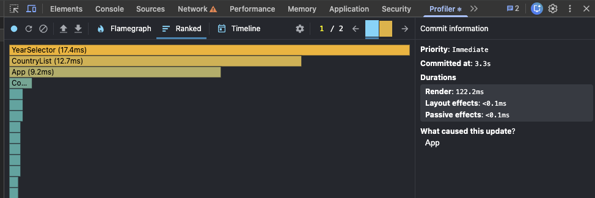
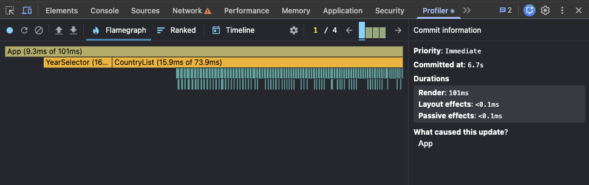
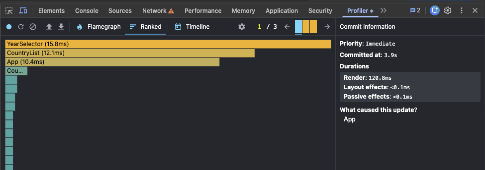
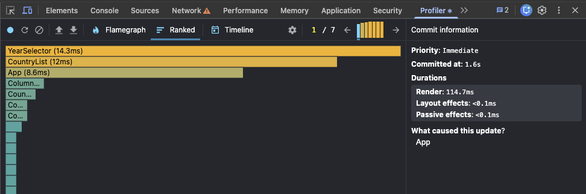
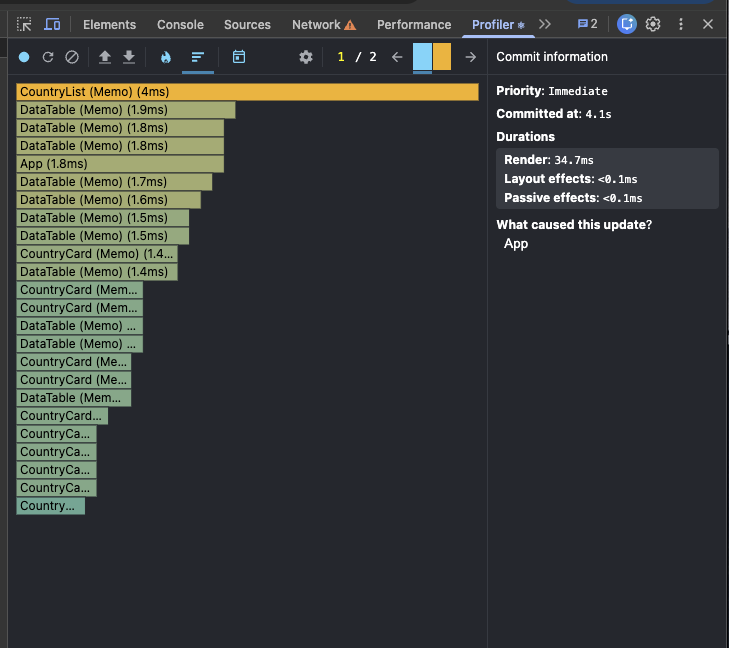
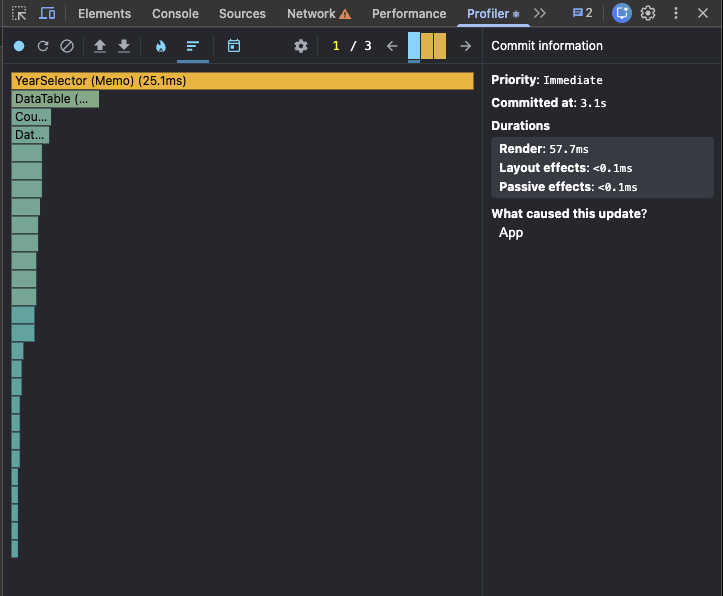
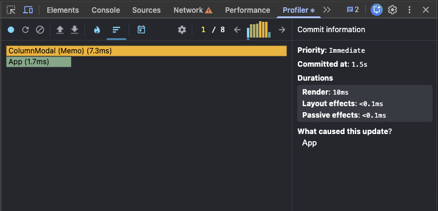

# PERFORMANCE.md

# React Performance Optimization Report

## Project

CO₂ Emissions Data Explorer

## Branch

`performance`

## Goal

The goal of this task is to profile the intentionally unoptimized React application, identify rendering bottlenecks, apply performance optimizations, and compare the results before and after the changes.

The application was profiled with **React DevTools Profiler** in development mode.

---

# Phase 1: Initial Profiling Baseline

## Profiling setup

The following user interactions were recorded:

1. Sorting countries
2. Searching for a country
3. Selecting a different year
4. Toggling columns

For each interaction, the React DevTools Profiler was used to capture:

- Commit duration
- Render duration
- Flamegraph screenshot
- Main components that re-rendered

---

## Baseline results

| Interaction                | Commit time | Render duration | Main components rendered                                              |
| -------------------------- | ----------: | --------------: | --------------------------------------------------------------------- |
| Sorting countries          |        3.3s |         122.2ms | App, CountryList, YearSelector, many CountryCard/DataTable components |
| Searching for a country    |        6.7s |           101ms | App, CountryList, many CountryCard/DataTable components               |
| Selecting a different year |        3.9s |         120.8ms | App, YearSelector, CountryList, many CountryCard/DataTable components |
| Toggling columns           |        1.6s |         114.7ms | App, YearSelector, CountryList, many CountryCard/DataTable components |

---

## 1. Sorting countries

### Result

- Commit time: **3.3s**
- Render duration: **122.2ms**

### Observation

Sorting caused the `App` component to update, which then caused `CountryList`, `YearSelector`, and many country rows/cards to render again.

The expensive part is inside `CountryList`, where countries are filtered and sorted directly during render. Population sorting is especially expensive because every comparison creates new year data maps using `createYearDataMap`.

### Bottleneck

The filtered and sorted countries are recalculated on every render, even when unrelated state changes occur.

---

## 2. Searching for a country

### Result

- Commit time: **6.7s**
- Render duration: **101ms**

### Observation

Typing into the search field updates the `App` state. This causes the whole component tree under `App` to render again.

The profiler shows that `CountryList` takes a large part of the render work because filtering is performed on every keystroke and all visible country cards are rendered again.

### Bottleneck

Search filtering is recalculated immediately during render, and the country list is not virtualized.

---

## 3. Selecting a different year

### Result

- Commit time: **3.9s**
- Render duration: **120.8ms**

### Observation

Changing the selected year causes `App`, `YearSelector`, `CountryList`, and many country cards to render.

Each `CountryCard` creates a new year data map during render. `DataTable` also filters the country data array to find the selected year.

### Bottleneck

Year-based values are recalculated for many countries on every year change.

---

## 4. Toggling columns

### Result

- Commit time: **1.6s**
- Render duration: **114.7ms**

### Observation

Toggling columns changes `selectedColumns` in the main `App` state. This causes the country list and data tables to render again.

The modal itself is small, but changing selected columns affects every country card because every `DataTable` receives a new list of columns.

### Bottleneck

Every rendered country card updates when columns change, and the full country list is rendered without virtualization.

---

# Baseline summary

The initial profiling shows several performance problems:

1. Expensive calculations are done directly inside render.
2. The country list is fully rendered without virtualization.
3. Event handlers are recreated on every render.
4. Components are not memoized.
5. Some list keys use array indexes instead of stable identifiers.
6. `CountryCard` and `DataTable` repeat year-based calculations many times.

---

# Planned optimizations

The following optimizations will be applied:

1. Use `useMemo` for computed values:
   - Available years
   - Available columns
   - Filtered and sorted countries
   - Year data maps
   - Selected year records

2. Use `useCallback` for event handlers:
   - Search handler
   - Year change handler
   - Sort handlers
   - Column toggle handler
   - Modal toggle handler

3. Use `React.memo`:
   - `SearchBar`
   - `YearSelector`
   - `ColumnModal`
   - `CountryList`
   - `CountryCard`
   - `DataTable`

4. Use stable keys:
   - `country.id` instead of array index
   - `column` instead of array index

5. Add virtualization for the large country list.

---

# Phase 2: Optimizations

This section will be updated after each optimization step.

---

# Phase 2: Optimizations

## Optimization 1: Memoized computed values and stabilized handlers

The first optimization focused on values and functions that were recreated on every render.

### Changes made

- Added `useMemo` for available years.
- Added `useMemo` for available columns.
- Added `useMemo` for filtered and sorted countries.
- Added `useMemo` for year data lookup in `CountryCard`.
- Added `useMemo` for selected year record lookup in `DataTable`.
- Added `useCallback` for search, year selection, sorting, column toggling, and modal toggling handlers.
- Replaced index-based country keys with stable `country.id` keys.
- Replaced index-based table row keys with stable `column` keys.

### Why this improves performance

Before this change, expensive computed values were recalculated during every render, even when their inputs had not changed.

Using `useMemo` allows React to reuse computed values until their dependencies change.

Using `useCallback` keeps handler references stable, which is important when child components are memoized with `React.memo`.

Stable keys also help React correctly identify list items between renders.

---

## Optimization 2: Memoized render components with React.memo

The second optimization focused on preventing child components from rendering when their props did not change.

### Changes made

The following components were wrapped with `React.memo`:

- `SearchBar`
- `YearSelector`
- `ColumnModal`
- `CountryList`
- `CountryCard`
- `DataTable`
- `LoadingSpinner`

### Why this improves performance

Before this change, child components could re-render whenever their parent component rendered.

After wrapping components with `React.memo`, React can skip rendering a component when its props are the same as during the previous render.

This makes the stable handlers from `useCallback` and memoized values from `useMemo` more effective.

---

## Optimization 3: Country list virtualization

The largest rendering bottleneck was the country list. The unoptimized version rendered every filtered country card and every nested data table at once.

To reduce the amount of work React performs per update, manual virtualization was implemented in `CountryList`.

Instead of rendering all countries, the component now calculates the visible range from the current scroll position and renders only the visible countries plus a small overscan buffer.

### Changes made

- Added a scroll container with a fixed height.
- Calculated total virtual list height.
- Calculated visible start and end indexes.
- Rendered only the visible slice of countries.
- Positioned visible items absolutely inside a spacer element.
- Adjusted item height based on the number of selected columns.

### Why this improves performance

Before virtualization, every update caused many `CountryCard` and `DataTable` components to render.

After virtualization, React only renders the country cards currently visible on the screen. This significantly reduces render work during sorting, searching, year selection, and column toggling.

---

## Optimization 4: Reused year data maps for country calculations

Population sorting was still expensive because `createYearDataMap` was called repeatedly inside the sort comparison function.

To fix this, each country is now prepared once with a reusable `yearDataMap`.

### Changes made

- Added `CountryWithYearMap` type.
- Created `countriesWithYearMap` with `useMemo`.
- Reused `yearDataMap` during population sorting.
- Passed the precomputed map to `CountryCard`.
- Updated `DataTable` to receive the selected year record directly instead of filtering the full data array.

### Why this improves performance

Sorting can compare population values without rebuilding maps many times. `CountryCard` and `DataTable` also avoid repeated year-based lookups and filtering.

---

## Optimization 5: Avoided unnecessary state updates

Some event handlers updated the main `App` state even when the selected value had not changed.

### Changes made

- Added equality checks before updating `searchQuery`, `selectedYear`, and `sortField`.
- Replaced the inline sort select handler with a stable `useCallback` handler.
- Continued using functional state updates to avoid stale state values.

### Why this improves performance

Returning the existing state object prevents unnecessary updates when the user selects the same value again. It also keeps handler references stable and makes memoized child components more effective.

---

# Phase 3: Final profiling comparison

After applying all optimizations, the same interactions were profiled again with React DevTools Profiler.

The optimized version includes:

- `useMemo` for expensive computed values
- `useCallback` for stable event handlers
- `React.memo` for memoized components
- Stable keys for lists and table rows
- Manual virtualization for the large country list
- Reused year data maps for country calculations
- Avoided unnecessary state updates in `App`

---

## Optimized results

| Interaction                | Baseline render | Optimized render |  Improvement |
| -------------------------- | --------------: | ---------------: | -----------: |
| Sorting countries          |         122.2ms |           34.7ms | 71.6% faster |
| Searching for a country    |           101ms |           29.4ms | 70.9% faster |
| Selecting a different year |         120.8ms |           57.7ms | 52.2% faster |
| Toggling columns           |         114.7ms |             10ms | 91.3% faster |

---

## 1. Sorting countries after optimization

### Result

- Baseline render duration: **122.2ms**
- Optimized render duration: **34.7ms**
- Improvement: **71.6% faster**

### What changed

Sorting became faster because the app no longer renders the full country list after every sort update.

Before optimization, sorting caused many `CountryCard` and `DataTable` components to render.

After optimization, the list is virtualized, so React renders only the visible country cards.

Population sorting was also improved by reusing precomputed year data maps instead of creating new maps repeatedly inside the sort comparison function.

---

## 2. Searching for a country after optimization

### Result

- Baseline render duration: **101ms**
- Optimized render duration: **29.4ms**
- Improvement: **70.9% faster**

### What changed

Searching still recalculates the filtered country list because the search query changes.

However, the render work is much smaller now because the app renders only the visible part of the filtered list.

Before optimization, many country cards and data tables were rendered during search.

After optimization, virtualization keeps the number of rendered components much lower.

---

## 3. Selecting a different year after optimization

### Result

- Baseline render duration: **120.8ms**
- Optimized render duration: **57.7ms**
- Improvement: **52.2% faster**

### What changed

Changing the year still affects visible country cards because their population, CO₂ value, and table data depend on the selected year.

However, the optimized version avoids rendering the full country list.

It also reuses year data maps, so each visible country can access the selected year data more efficiently.

---

## 4. Toggling columns after optimization

### Result

- Baseline render duration: **114.7ms**
- Optimized render duration: **10ms**
- Improvement: **91.3% faster**

### What changed

This interaction improved the most.

Before optimization, toggling a column caused many country cards and data tables to render.

After optimization, the profiler shows mostly `ColumnModal (Memo)` and a small `App` update. This is expected because the column modal is the component directly affected by the column selection.

Virtualization also prevents the whole country list from being rendered.

---

# Final conclusion

The optimized application performs significantly better than the initial version.

The main bottleneck was rendering the full country list and recalculating country/year data during render.

The largest improvement came from virtualization, because it reduced the number of mounted and rendered `CountryCard` and `DataTable` components.

Additional improvements came from memoization, stable callbacks, stable keys, and reusing computed year data maps.

Overall, all required optimization techniques were applied:

| Requirement                                         | Status |
| --------------------------------------------------- | ------ |
| `useMemo` used for computed values                  | Done   |
| `useCallback` used for event handlers               | Done   |
| `React.memo` used to prevent unnecessary re-renders | Done   |
| Proper key props used for lists and tables          | Done   |
| Virtualization implemented for large country list   | Done   |
